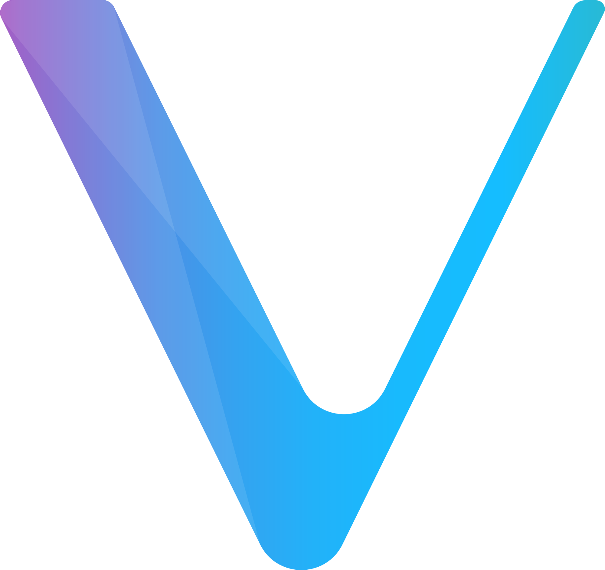

#  Hi there 👋, I am Arpit Srivastava!

 
 
 

 

# 👦 About Me

-   🎓  I am a third year IIIT Vadodara CSE undergraduate.
-   🔨  I am a blockchain - backend developer.
-   💗  I love hackathons for bringing my ideas to life. Check out my org BakaOtaku for these projects.
- 🏆 I have won Ocean DEC, Cosmos Hackatom India, HackTheHorizon by Harmony and several other hackathons.
-   🚀  When free, you will find me playing Cricket or viewing CoinMarketCap

# 🧰 My Toolkit:

